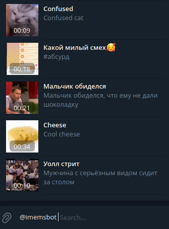

# Memgram

## Описание
Проект "Memgramm" предоставляет возможность обычным пользователям Telegram отправлять мемы в инлайн-режиме. Основной целью проекта является облегчение и ускорение процесса отправки мемов, а также уменьшение нагрузки на устройства пользователей за счет хранения мемов на серверах Telegram.

## Установка и настройка
## Запуск проекта
Клонируйте репозиторий и выполните следующие действия в командной строке:
```bash
cd Memgram
pip install -r requirements.txt
python bot/main.py
```
## Хранение мемов
Так как хранение видео-мемов в памяти занимает много места, мы используем приватный Telegram канал для их хранения. Это также обеспечивает мгновенную отправку мемов, так как они хранятся на серверах Telegram.

## Инструкция по использованию
Для отправки мемов в инлайн-режиме, выполните следующие шаги:
1. Откройте Telegram и перейдите в чат или беседу, где вы хотите отправить мем.
2. Напишите команду для активации инлайн-режима(адресс бота).
3. Перейдите к выбору мема и отправьте его в чат.



## Команды бота

### Общие команды
- `/start` - Начать использование бота.
- `/random` - Получить случайное видео.

## Административные команды
- `/get_db` - Получить доступ к базе данных.
- `/add_admin` - Добавить нового администратора.

## Обработчики для добавления видео
- `/upload` - Загрузка видео.
- `/edit` - Редактирование видео.
- `/delete` - Удаление видео.
- `/cancel` - Отмена.

### Поиск и отправка видео
- Inline-поиск: Поиск видео в режиме реального времени.
